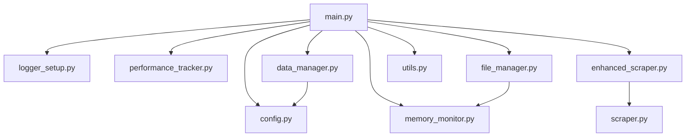

# **File Dependency Map for LinkedInsight Pipeline**

Here's the complete dependency structure showing which file depends on which:

## **📊 Dependency Hierarchy**

```
main.py (Entry Point)
├── config.py
├── logger_setup.py
├── performance_tracker.py
├── memory_monitor.py
├── enhanced_scraper.py
│   └── scraper.py
├── data_manager.py
│   └── config.py
├── file_manager.py
│   └── memory_monitor.py
└── utils.py
```

## **🔗 Detailed Dependencies**

### **1. main.py** → Depends on ALL modules
```python
from config import KEYWORDS, LOCATIONS, MAX_JOBS_PER_LOCATION, MAX_HISTORY_FILES, get_directories
from logger_setup import setup_logging
from performance_tracker import PerformanceTracker
from memory_monitor import log_memory_checkpoint, get_dataframe_memory_usage, cleanup_memory, get_directory_size
from enhanced_scraper import TimedLinkedInScraper
from data_manager import ensure_required_columns, validate_dataframe, process_cumulative_data
from file_manager import save_json_safely, load_json_safely, save_parquet_files, save_performance_data, save_pipeline_status, cleanup_old_files
from utils import validate_environment, print_summary
```

### **2. enhanced_scraper.py** → Depends on
```python
from scraper import LinkedInScraper  # Base scraper class
import time
import logging
```

### **3. data_manager.py** → Depends on
```python
from config import REQUIRED_COLUMNS  # Configuration
import pandas as pd
import logging
from datetime import datetime
```

### **4. file_manager.py** → Depends on
```python
from memory_monitor import get_file_size, get_directory_size  # File monitoring
import os
import json
import glob
import logging
import pandas as pd
import traceback
from datetime import datetime
```

### **5. scraper.py** → Depends on (External packages only)
```python
import requests
import pandas as pd
from bs4 import BeautifulSoup
import random
import time
from datetime import datetime
import logging
import re
from urllib.parse import quote
import json
from requests.adapters import HTTPAdapter
from urllib3.util.retry import Retry
```

### **6. Independent Files** (No internal dependencies)
- **config.py** → Only standard library
- **logger_setup.py** → Only standard library
- **performance_tracker.py** → Only standard library
- **memory_monitor.py** → Only standard library + psutil
- **utils.py** → Only standard library

## **📋 Import Matrix**

| File | config.py | logger_setup.py | performance_tracker.py | memory_monitor.py | scraper.py | enhanced_scraper.py | data_manager.py | file_manager.py | utils.py |
|------|-----------|------------------|-------------------------|-------------------|------------|---------------------|-----------------|-----------------|----------|
| **main.py** | ✅ | ✅ | ✅ | ✅ | ❌ | ✅ | ✅ | ✅ | ✅ |
| **enhanced_scraper.py** | ❌ | ❌ | ❌ | ❌ | ✅ | ❌ | ❌ | ❌ | ❌ |
| **data_manager.py** | ✅ | ❌ | ❌ | ❌ | ❌ | ❌ | ❌ | ❌ | ❌ |
| **file_manager.py** | ❌ | ❌ | ❌ | ✅ | ❌ | ❌ | ❌ | ❌ | ❌ |
| **scraper.py** | ❌ | ❌ | ❌ | ❌ | ❌ | ❌ | ❌ | ❌ | ❌ |
| **config.py** | ❌ | ❌ | ❌ | ❌ | ❌ | ❌ | ❌ | ❌ | ❌ |
| **logger_setup.py** | ❌ | ❌ | ❌ | ❌ | ❌ | ❌ | ❌ | ❌ | ❌ |
| **performance_tracker.py** | ❌ | ❌ | ❌ | ❌ | ❌ | ❌ | ❌ | ❌ | ❌ |
| **memory_monitor.py** | ❌ | ❌ | ❌ | ❌ | ❌ | ❌ | ❌ | ❌ | ❌ |
| **utils.py** | ❌ | ❌ | ❌ | ❌ | ❌ | ❌ | ❌ | ❌ | ❌ |

## **🎯 Execution Flow**



## **📝 Installation Order**

Based on dependencies, install/create files in this order:

1. **config.py** (No dependencies)
2. **logger_setup.py** (No dependencies)
3. **performance_tracker.py** (No dependencies)
4. **memory_monitor.py** (No dependencies)
5. **utils.py** (No dependencies)
6. **scraper.py** (No internal dependencies)
7. **data_manager.py** (Depends on config.py)
8. **enhanced_scraper.py** (Depends on scraper.py)
9. **file_manager.py** (Depends on memory_monitor.py)
10. **main.py** (Depends on all others)

## **🔧 Dependency Summary**

### **Level 0 (No Dependencies)**
- config.py
- logger_setup.py
- performance_tracker.py
- memory_monitor.py
- utils.py
- scraper.py

### **Level 1 (Depends on Level 0)**
- data_manager.py → config.py
- enhanced_scraper.py → scraper.py
- file_manager.py → memory_monitor.py

### **Level 2 (Orchestrator)**
- main.py → All Level 0 & Level 1 files

This clean dependency structure ensures:
- ✅ **No circular dependencies**
- ✅ **Clear separation of concerns**
- ✅ **Easy to modify individual components**
- ✅ **Simple testing and debugging**